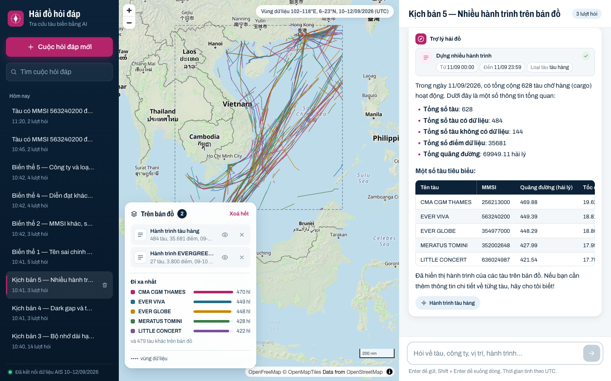
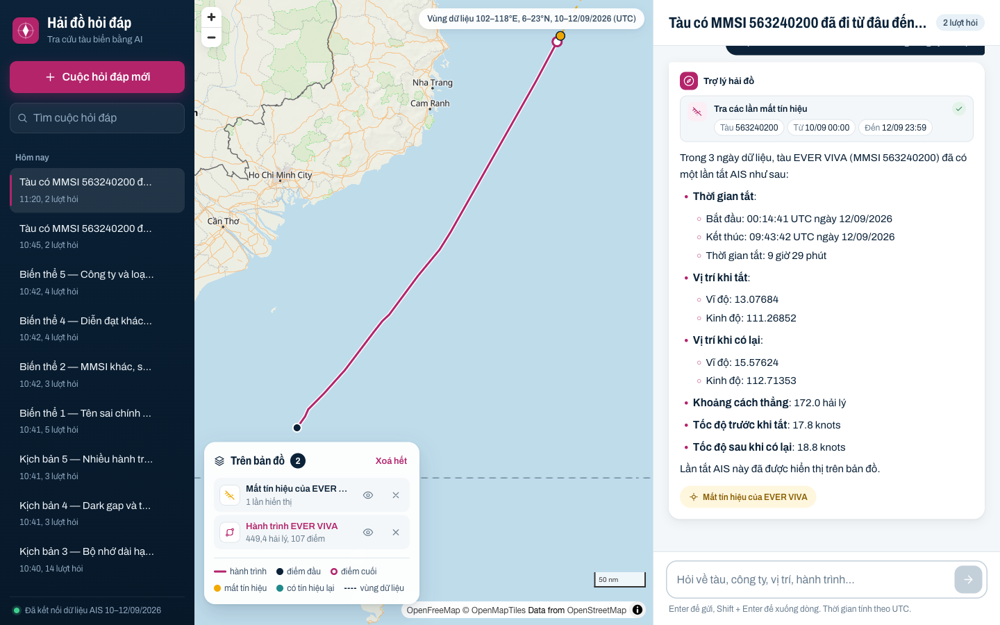
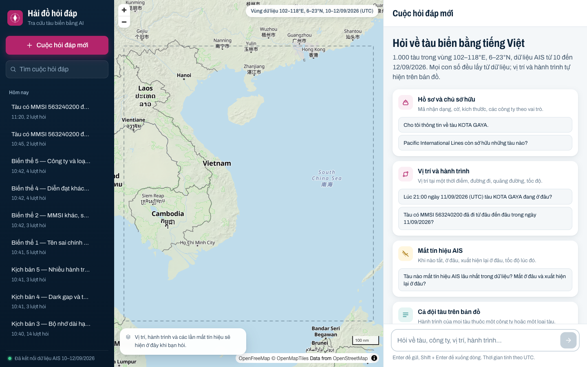
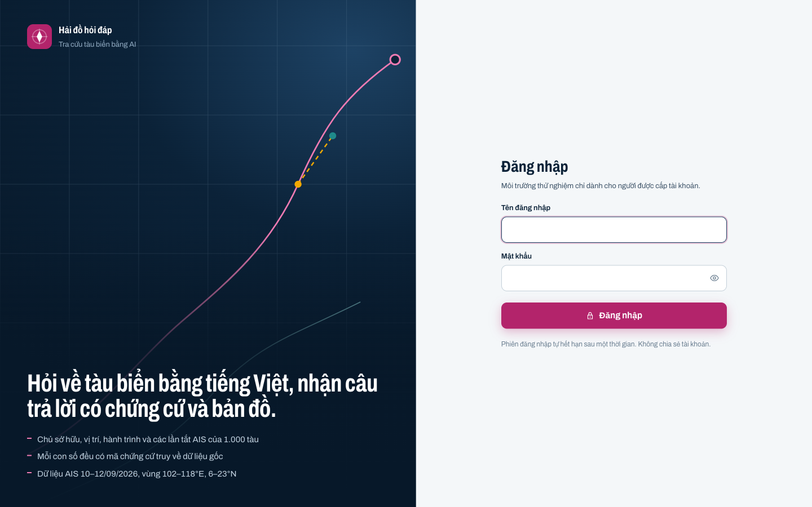
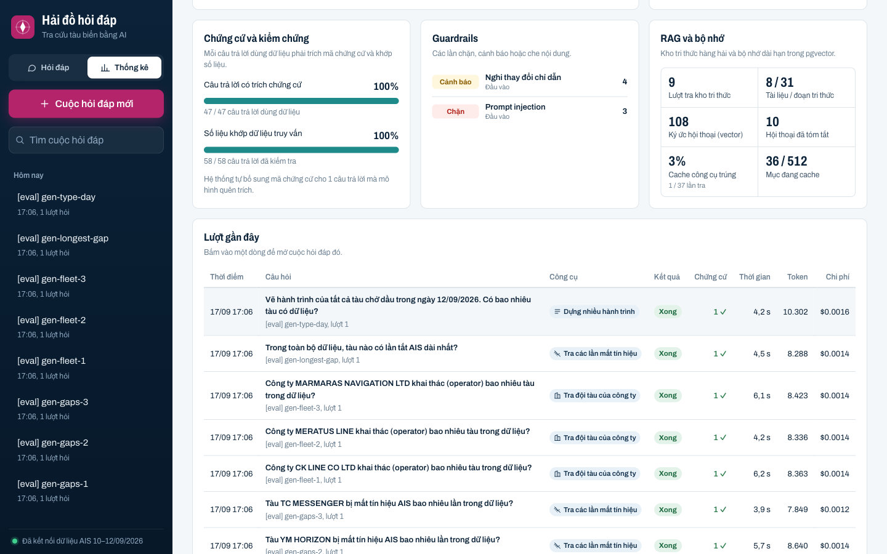

# Vessel Chat: chatbot tra cứu tàu biển

Chatbot LLM trả lời câu hỏi tiếng Việt về 1.000 tàu (AIS 10–12/09/2026): tàu của ai, đang ở đâu, đã đi những đâu, có tắt AIS không. **Mỗi câu trả lời có chứng cứ** và được hệ thống tự đối chiếu số liệu.

- **API chat streaming (SSE).** Các sự kiện gồm `token`, `tool_call`, `tool_result`, `evidence`, `verification`, `guardrail`, `data`, `memory`, `error`, `done`.
- **Truy vấn có tham số.** LLM lấy số liệu qua 10 tool (9 tool truy vấn PostgreSQL + PostGIS, 1 tool kho tri thức); không đưa CSV vào prompt, không để LLM tự viết SQL; tool chạy trên pool DB chỉ đọc.
- **Chứng cứ và kiểm chứng.** Mỗi kết quả tool có mã `E#` (bảng nguồn, tham số, giá trị gốc); câu trả lời trích `[E#]`; hệ thống đối chiếu mọi con số với dữ liệu đã truy vấn.
- **RAG.** Kho tri thức nghiệp vụ hàng hải (AIS, loại tàu, dark gap, MMSI/IMO, vai trò chủ sở hữu, đơn vị đo), tìm kiếm lai vector + từ khoá (RRF), có trích dẫn.
- **Guardrails.** Chặn prompt injection trước khi gọi LLM, kiểm duyệt nội dung, che secret và chặn lộ prompt ngay trên stream, từ chối chủ đề ngoài phạm vi.
- **Bộ nhớ dài hạn.** Kết hợp trạng thái hội thoại, tóm tắt cuốn chiếu, truy xuất vector (pgvector) và cửa sổ nguyên văn cấu hình được.
- **Harness đánh giá.** Câu hỏi sinh từ dữ liệu thật (đáp án bằng SQL) cùng các ca red-team; **45/45 ca đạt**.
- **Đăng nhập.** Màn hình đăng nhập (tài khoản cấu hình trong `AUTH_USERS`, mặc định `demo` / `demo`); API chỉ phục vụ khi có token phiên hợp lệ.
- **Bảo mật và vận hành.** API key, rate limit, header bảo mật và CSP, `/metrics` Prometheus, log JSON, cache kết quả tool, container không chạy root.
- **Trang Thống kê vận hành.** Số lượt, tỉ lệ thành công, chi phí, độ trễ, công cụ, cache, guardrail, tỉ lệ trích chứng cứ, RAG, kết quả harness và quy mô dữ liệu; đọc từ cơ sở dữ liệu nên còn nguyên sau khi khởi động lại.
- **Giao diện web + SEO/GEO.** Danh sách hội thoại, stream, thẻ chứng cứ, bản đồ MapLibre (vị trí, hành trình, mất tín hiệu, hàng chục nghìn điểm); Open Graph, JSON-LD, `llms.txt`.



<table>
<tr>
<td></td>
<td></td>
</tr>
<tr>
<td align="center">Hành trình + lần tắt AIS, hỏi nối tiếp "của nó"</td>
<td align="center">Màn hình bắt đầu, khung vùng dữ liệu</td>
</tr>
</table>

<table>
<tr>
<td></td>
<td></td>
</tr>
<tr>
<td align="center">Đăng nhập trước khi dùng chatbot</td>
<td align="center">Thống kê vận hành</td>
</tr>
</table>


| Tài liệu | Nội dung |
|---|---|
| [docs/VegaStar-Tong-quan.pdf](docs/VegaStar-Tong-quan.pdf) | Tài liệu tổng quan 15 trang: yêu cầu, cách hoạt động, công nghệ, bảo mật, tối ưu, thống kê vận hành, ứng dụng, mở rộng |
| [docs/architecture.md](docs/architecture.md) | Kiến trúc, luồng xử lý, bộ nhớ, schema, tool, hạn chế, chi phí, hướng mở rộng |
| [docs/research.md](docs/research.md) | Lựa chọn LLM, embedding, vector DB, framework; so sánh các chiến lược bộ nhớ; vì sao không dùng Neo4j, Elasticsearch |
| [docs/api.md](docs/api.md) · [docs/openapi.json](docs/openapi.json) | Các endpoint và sự kiện SSE, kèm ví dụ `curl` |
| [SECURITY.md](SECURITY.md) | Mô hình đe doạ, các lớp phòng thủ, việc cần làm trước khi lên production |
| [results/](results/README.md) | Transcript chạy 5 kịch bản của đề và 4 biến thể; đáp án đối chiếu bằng SQL |
| [results/eval_report.md](results/eval_report.md) | Báo cáo harness đánh giá: tỉ lệ đạt theo nhóm và tiêu chí, độ trễ, chi phí |

## Trạng thái yêu cầu

| Mã | Trạng thái | Ghi chú |
|---|---|---|
| R1 | ✅ | Script nạp chạy lại được nhiều lần (COPY → TRUNCATE + INSERT trong một transaction, ~8 giây); có chỉ mục GiST/B-tree/trigram. Tool dùng SQL có tham số. Tìm tàu theo tên (chịu sai chính tả), MMSI, IMO, callsign; nhiều kết quả thì hỏi lại. |
| R2 | ✅ | CRUD hội thoại; `POST /conversations/{id}/chat` stream SSE theo token; lỗi được báo qua sự kiện `error`, stream vẫn kết thúc bằng `done`. Các hội thoại chạy song song độc lập; có lệnh `curl` xem stream. |
| R3 | ✅ | Toàn bộ tin nhắn lưu trong Postgres. Giữ trạng thái đối tượng đang bàn để hiểu "nó", "tàu đó", "công ty đó". Tóm tắt + pgvector; `MEMORY_WINDOW_TURNS` cấu hình được. Kịch bản 3 chạy với cửa sổ 2 lượt. |
| R4 | ✅ | a) thông tin tàu và công ty theo vai trò, các tàu khác cùng chủ; b) vị trí gần nhất kèm độ lệch và **nội suy**; c) hành trình, quãng đường, tốc độ, GeoJSON; d) dark gap kèm tốc độ trước/sau khi mất. |
| N1 | ✅ | React + Vite: danh sách hội thoại (tìm kiếm, nhóm theo ngày), tạo mới/mở lại/xoá, câu trả lời stream theo token, các bước tra cứu hiện dạng thẻ có trạng thái và tham số, ghi chú khi nhớ lại từ bộ nhớ dài hạn. |
| N2 | ✅ | Sự kiện `data` mang `data_id`; client tải GeoJSON từ `/map-data/{id}`. Câu nối tiếp "hiện thêm các lần tắt AIS của nó" thêm lớp mới lên bản đồ. Mỗi câu trả lời có nút phóng tới lớp bản đồ tương ứng; bấm lên tuyến/điểm để xem chi tiết. |
| N3 | ✅ | `GET /tracks` trả FeatureCollection nhiều tàu, có phân trang. Hỏi qua chat ("hành trình tất cả tàu do X khai thác", "toàn bộ tàu cargo ngày 11/09"): 484 tàu, 35,7 nghìn điểm vẽ bằng WebGL. LLM chỉ nhận bản tóm tắt. |
| D1 | ✅ | README này, `.env.example` giải thích mọi biến, ví dụ `curl`. |
| D2 | ✅ | `docs/research.md`, `docs/architecture.md`. |
| D3 | ✅ | 189 test pytest (tầng truy vấn, tool, bộ nhớ, guardrail, RAG, chứng cứ, bảo mật, đăng nhập, thống kê, tích hợp API) + 17 test frontend; `results/` chứa transcript kịch bản, đáp án SQL và báo cáo harness đánh giá. |

### Mở rộng cho sản phẩm AI

| Hạng mục | Nội dung | Ở đâu |
|---|---|---|
| Chứng cứ | Mã `E#` cho mỗi kết quả tool, trích dẫn trong câu trả lời, thẻ chứng cứ trên giao diện, tự bổ sung khi model quên | `chat/evidence.py`, `frontend/src/components/EvidencePanel.tsx` |
| Guardrails | Injection (VI/EN) và dữ liệu dán giả, moderation, phạm vi, che secret và lộ prompt trên stream, đối chiếu số liệu | `guardrails/`, [architecture §6](docs/architecture.md#6-guardrails) |
| RAG | 8 tài liệu nghiệp vụ, ingest idempotent, hybrid search + RRF, trích dẫn | `knowledge/`, `rag/`, [architecture §8](docs/architecture.md#8-kho-tri-thức-rag) |
| Harness | Sinh ca từ dữ liệu (seed), red-team, chấm xác định, báo cáo, ngưỡng CI | `evals/`, [results/eval_report.md](results/eval_report.md) |
| Đăng nhập | Form đăng nhập, token phiên ký HMAC có hạn dùng, mật khẩu thường hoặc băm PBKDF2, giới hạn số lần thử, tự đăng xuất khi token hết hạn | `api/auth.py`, `api/routes_auth.py`, `frontend/src/components/LoginScreen.tsx` |
| Security | API key, rate limit, header và CSP, giới hạn body, pool chỉ đọc, lỗi 500 an toàn, container không root | `api/security.py`, [SECURITY.md](SECURITY.md) |
| Hiệu năng và quan sát | Cache tool, truy vấn LATERAL, gzip, ETag, `/metrics`, log JSON có chi phí | `tools/cache.py`, `observability.py` |
| Thống kê vận hành | Telemetry từng lượt lưu trong DB; `GET /stats`; tab Thống kê (`#/thong-ke`) với KPI, biểu đồ theo ngày, công cụ, guardrail, chất lượng, lượt gần đây, harness | `api/routes_stats.py`, `repositories/stats.py`, `frontend/src/components/StatsView.tsx` |
| SEO/GEO | Meta, Open Graph, JSON-LD, nội dung tĩnh cho bot, robots, sitemap, `llms.txt` | `frontend/index.html`, `frontend/public/` |

## Yêu cầu hệ thống

- Docker 24+ và Docker Compose v2 (bắt buộc)
- Để chạy ngoài Docker và chạy test: Python 3.12+ và Node 20+
- OpenAI API key (mặc định dùng `gpt-4o-mini` và `text-embedding-3-small`). Có thể thay bằng endpoint tương thích OpenAI qua `OPENAI_BASE_URL`.
- 4 file CSV của đề đặt trong thư mục `data/`. Dữ liệu **không** nằm trong repo.

## Chạy nhanh bằng Docker

```bash
cp .env.example .env            # điền OPENAI_API_KEY, đổi POSTGRES_PASSWORD (và DATABASE_URL tương ứng)
# đặt vessels.csv, ais_positions.csv, dark_gaps.csv, ownership.csv vào ./data
docker compose up -d --build    # db (PostGIS + pgvector), api, web
docker compose run --rm api python scripts/load_data.py   # tạo schema + nạp dữ liệu (chạy lại không nhân đôi)
```

Kho tri thức (`knowledge/`) được tự đồng bộ khi API khởi động (`RAG_AUTO_INGEST=true`), hoặc chạy thủ công: `docker compose run --rm api python scripts/ingest_knowledge.py`.

- Giao diện: http://localhost:5173, đăng nhập bằng tài khoản trong `AUTH_USERS` (mặc định **demo / demo**); trang thống kê: http://localhost:5173/#/thong-ke
- API: http://localhost:8000 (tài liệu tương tác tại `/docs`, số liệu vận hành tại `/stats`)

Nếu cổng bị chiếm, đổi `DB_HOST_PORT`, `API_HOST_PORT`, `WEB_HOST_PORT` trong `.env`. Khi đổi cổng API, sửa luôn `VITE_API_BASE_URL` và `CORS_ORIGINS` rồi build lại `web`.

Để kiểm tra bộ nhớ dài hạn nhanh hơn, đặt `MEMORY_WINDOW_TURNS=2` trong `.env`, rồi chạy `docker compose up -d api`.

## Đăng nhập

Khi `AUTH_USERS` có giá trị, giao diện hiện form đăng nhập và **mọi API** (hội thoại, chat, bản đồ, thống kê) trả 401 nếu thiếu token. Chỉ `/health`, `/auth/login`, `/metrics`, `/docs` công khai.

```dotenv
AUTH_USERS=demo:demo                 # nhiều tài khoản: demo:demo,analyst:<mật khẩu>
SESSION_SECRET=<chuỗi ngẫu nhiên dài>   # python -c "import secrets; print(secrets.token_urlsafe(32))"
SESSION_TTL_HOURS=12
RATE_LIMIT_LOGIN_PER_MINUTE=10
```

- Đăng nhập: `POST /auth/login` trả token phiên ký HMAC, giao diện lưu token và gửi `Authorization: Bearer …`. Hết hạn hoặc bị từ chối thì tự quay về form đăng nhập; nút **Đăng xuất** ở cuối thanh bên trái.
- Không muốn để mật khẩu thường trong `.env`: chạy `python scripts/hash_password.py` rồi dùng chuỗi `pbkdf2_sha256$…` in ra (`AUTH_USERS=demo:pbkdf2_sha256$…`).
- Đổi `SESSION_SECRET` thu hồi mọi phiên. Để trống thì API tự sinh khoá mỗi lần khởi động (người dùng phải đăng nhập lại).
- `VITE_LOGIN_HINT` (tuỳ chọn) hiện một dòng gợi ý dưới form, ví dụ khi muốn cho người xem demo biết tài khoản.
- Script và harness: đặt `API_USERNAME` / `API_PASSWORD` (hoặc `--username` / `--password`), hoặc dùng `API_KEY` cho tích hợp máy với máy.
- Tắt đăng nhập (chạy cục bộ): để trống `AUTH_USERS` và `API_KEYS`.

**Bảo mật khi public:** đổi mật khẩu `demo` hoặc dùng chuỗi băm, đặt `SESSION_SECRET`, `CORS_ORIGINS`, `API_ORIGIN`, `VITE_SITE_URL` đúng tên miền, bật HTTPS, và chặn `/metrics`, `/docs` ở reverse proxy. Xem [SECURITY.md](SECURITY.md).

## Chạy ngoài Docker (phát triển)

```bash
docker compose up -d db
python3 -m venv .venv && .venv/bin/pip install -e '.[dev]'
.venv/bin/python scripts/load_data.py
.venv/bin/uvicorn vessel_chat.api.app:app --reload --port 8000

cd frontend && npm ci
cp .env.example .env.local      # VITE_API_BASE_URL trỏ tới API
npm run dev                     # http://localhost:5173
```

## Xem stream trong terminal

```bash
export API_USERNAME=demo API_PASSWORD=demo                                  # khi server bật đăng nhập
scripts/stream_chat.sh "Cho tôi thông tin về tàu KOTA GAYA."                 # tạo hội thoại mới, in conversation_id
scripts/stream_chat.sh "Chủ sở hữu của tàu này là ai?" <conversation_id>     # hỏi tiếp
```

Hoặc dùng `curl` trực tiếp:

```bash
TOKEN=$(curl -s -X POST localhost:8000/auth/login -H 'Content-Type: application/json' \
  -d '{"username":"demo","password":"demo"}' | python3 -c 'import sys,json;print(json.load(sys.stdin)["token"])')
AUTH="Authorization: Bearer $TOKEN"
CID=$(curl -s -X POST localhost:8000/conversations -H "$AUTH" -H 'Content-Type: application/json' -d '{}' | python3 -c 'import sys,json;print(json.load(sys.stdin)["id"])')
curl -N -X POST localhost:8000/conversations/$CID/chat \
  -H "$AUTH" -H 'Content-Type: application/json' \
  -d '{"message": "Tàu có MMSI 563240200 đã đi từ đâu đến đâu trong ngày 11/09/2026?"}'
```

Kết quả nhận được có dạng:

```
event: memory
data: {"window_turns": [], "summary_used": false, "retrieved": []}

event: tool_call
data: {"id": "call_…", "name": "get_track", "args": {"vessel": "563240200", "start": "2026-09-11T00:00:00Z", "end": "2026-09-11T23:59:59Z"}}

event: data
data: {"data_id": "7806b8ea-…", "kind": "track", "bbox": [106.98, 6.80, 111.21, 12.98], …}

event: tool_result
data: {"id": "call_…", "name": "get_track", "ok": true, "summary": {"status": "ok", "point_count": 107, "distance_nm": 449.39, "vessel": "EVER VIVA"}}

event: token
data: {"text": "Trong"}
…
event: done
data: {"message_id": 42, "turn": 1, "usage": {…}, "data_ids": ["7806b8ea-…"]}
```

Xem thêm ví dụ trong [docs/api.md](docs/api.md).

## Thống kê vận hành

Bấm **Thống kê** ở thanh bên trái (hoặc mở `#/thong-ke`). Trang tự làm mới mỗi 30 giây, chọn được khoảng 24 giờ, 7 ngày, 30 ngày hoặc toàn bộ:

- **KPI:** số lượt và cuộc hỏi đáp, tỉ lệ trả lời thành công, chi phí LLM (tổng và mỗi lượt), thời gian tới chữ đầu tiên (trung vị, p95), tỉ lệ câu trả lời khớp dữ liệu.
- **Biểu đồ:** lượt hỏi đáp và chi phí theo ngày (di chuột để xem chi tiết); kết quả các lượt (xong, bị chặn, lỗi, người dùng dừng).
- **Công cụ:** số lần gọi, tỉ lệ thành công, tỉ lệ trúng cache, độ trễ trung vị và p95 của từng tool.
- **Chất lượng:** tỉ lệ trích chứng cứ, tỉ lệ số liệu khớp, số câu hệ thống phải tự gắn chứng cứ; sự kiện guardrail theo loại; RAG và bộ nhớ.
- **Lượt gần đây:** câu hỏi, công cụ, kết quả, chứng cứ, thời gian, token, chi phí; bấm để mở lại cuộc hỏi đáp.
- **Harness, dữ liệu, cấu hình:** kết quả `results/eval_report.json`, quy mô dữ liệu nguồn, mô hình và các thiết lập đang chạy.

Mỗi lượt lưu `meta.telemetry` (kết quả, độ trễ, token, chi phí, thời gian và trạng thái cache của từng tool) trong bảng `messages`, nên số liệu không mất khi khởi động lại API. Lượt tạo trước khi có tính năng này vẫn được tính số lượt, token, công cụ và guardrail, chỉ thiếu độ trễ. Tắt bằng `STATS_ENABLED=false`; khi public, chỉ cho quản trị viên truy cập (xem [SECURITY.md](SECURITY.md)).

## Chạy test

Test dùng PostgreSQL thật: database `vessel_test` được container DB tạo sẵn ở lần khởi tạo đầu tiên. Dữ liệu test là một bộ nhỏ tự sinh trong `tests/fixtures`. LLM và embedding trong test là bản giả, nên **không gọi OpenAI**.

```bash
docker compose up -d db
.venv/bin/pytest -q              # 189 test: truy vấn, tool, bộ nhớ, guardrail, RAG, chứng cứ, bảo mật, đăng nhập, thống kê, API/SSE
cd frontend && npm test          # 17 test: bộ đọc SSE, dựng transcript, nhãn tham số, liên kết chứng cứ, định dạng thống kê, phiên đăng nhập
```

## Harness đánh giá

```bash
# API đang chạy; nên nâng RATE_LIMIT_CHAT_PER_MINUTE (vd. 120) cho lần chạy đánh giá
export API_USERNAME=demo API_PASSWORD=demo                                     # khi server bật đăng nhập
.venv/bin/python evals/generate.py --seed 7                                    # sinh ca từ dữ liệu (đáp án bằng SQL)
.venv/bin/python evals/run.py --api-url http://localhost:8000 --min-pass-rate 0.85   # → results/eval_report.md
.venv/bin/python evals/generate.py --seed 21 --out /tmp/cases.yaml && \
  .venv/bin/python evals/run.py --cases evals/cases.static.yaml /tmp/cases.yaml    # bộ câu hỏi mới
```

Exit code khác 0 khi tỉ lệ đạt dưới ngưỡng, nên dùng được trong CI. Kết quả hiện tại: **45/45** (seed 7, gồm 3 ca đếm/liệt kê tàu) và **26/26** (seed 21, bộ câu hỏi trước khi có nhóm này); khoảng 0,0015 USD mỗi ca.

## Chạy lại kịch bản và đối chiếu đáp án

```bash
# API đang chạy (nên đặt MEMORY_WINDOW_TURNS=2)
.venv/bin/python scripts/run_scenarios.py --api-url http://localhost:8000     # → results/*.md, results/raw/*.jsonl
.venv/bin/python scripts/verify_facts.py                                     # → results/facts.md (SQL trực tiếp)
```

Các kịch bản nằm trong `scenarios/scenarios.yaml`. Để thử cách diễn đạt khác, chỉ cần thêm vào file này; code và prompt không chứa tên tàu hay đáp án nào.

## Cấu trúc

```
src/vessel_chat/
  config.py              cấu hình (env)
  loader.py, schema.sql  nạp dữ liệu và schema
  normalize.py, geo.py   chuẩn hoá tên, nhóm loại tàu; hình học hành trình
  repositories/          SQL có tham số (tàu, vị trí, dark gap, hội thoại, bộ nhớ, dữ liệu bản đồ)
  tools/                 10 tool cho LLM (schema Pydantic → JSON schema) + cache
  rag/                   chia đoạn, ingest, tìm kiếm lai
  guardrails/            kiểm tra đầu vào, lọc và kiểm chứng đầu ra
  llm/                   client OpenAI (chat, embedding, moderation) và prompt
  memory/manager.py      bộ nhớ kết hợp
  chat/                  vòng lặp LLM ↔ tool, chứng cứ, sự kiện
  api/                   FastAPI, đăng nhập (token phiên), bảo mật (API key, rate limit, header), thống kê vận hành
  observability.py       metrics Prometheus, log JSON
knowledge/               tài liệu nghiệp vụ cho RAG
evals/                   harness đánh giá (sinh ca, ca tĩnh/red-team, chấm điểm)
scripts/                 load_data.py, ingest_knowledge.py, stream_chat.sh, run_scenarios.py, verify_facts.py, hash_password.py
tests/                   unit + integration (+ fixtures)
frontend/                React + Vite + MapLibre; public/ có robots, sitemap, llms.txt
docs/                    research.md, architecture.md, api.md, openapi.json, images/
results/                 transcript kịch bản, đáp án SQL, báo cáo đánh giá
```

> Dữ liệu chỉ dùng cho bài test. `data/` và file đề đã nằm trong `.gitignore`.
