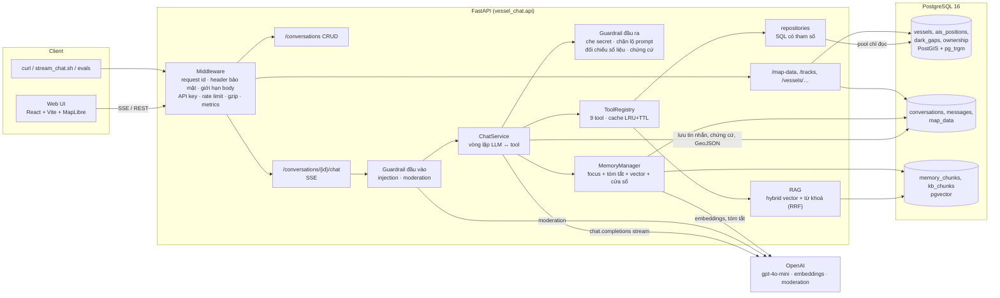
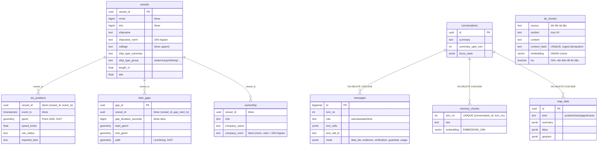

# Kiến trúc

## 1. Sơ đồ thành phần



**Nguyên tắc chính**

- **LLM không bao giờ thấy dữ liệu thô.** Tool trả cho LLM một bản tóm tắt đã giới hạn (`TOOL_RESULT_MAX_ROWS`). GeoJSON được lưu vào bảng `map_data`, stream chỉ gửi `data_id`, và client tự tải về.
- **Mỗi câu trả lời có chứng cứ.** Mỗi kết quả tool mang mã `E#` (bảng nguồn, tham số, giá trị gốc); LLM phải trích mã; hệ thống đối chiếu số liệu và mã sau khi trả lời.
- **Phòng thủ nhiều lớp.** Guardrail đầu vào → prompt có phạm vi → tool chỉ đọc có tham số → guardrail đầu ra (xem [SECURITY.md](../SECURITY.md)).
- **Không có text-to-SQL.** Mọi truy vấn là SQL viết sẵn với tham số `$n` (asyncpg). Những lựa chọn như `order_by` được ánh xạ sang các đoạn SQL cố định.
- **Mọi thành phần phụ thuộc vào giao diện, không phụ thuộc cài đặt cụ thể.** `ChatService` chỉ biết `LLMClient`/`Embedder` (Protocol), nên test thay bằng bản giả và đổi nhà cung cấp chỉ cần viết một lớp mới.
- **Mọi ngưỡng đều cấu hình được** qua biến môi trường (`config.Settings`, danh sách đầy đủ trong `.env.example`).

## 2. Luồng xử lý một câu hỏi

```mermaid
sequenceDiagram
  autonumber
  participant C as Client
  participant A as API /chat
  participant S as ChatService
  participant G as Guardrails
  participant M as MemoryManager
  participant L as LLM (stream)
  participant T as Tool
  participant DB as Postgres

  C->>A: POST {message} (API key, rate limit)
  A->>DB: hội thoại tồn tại?
  A-->>C: 200 text/event-stream
  A->>S: run_turn (khoá theo hội thoại)
  S->>M: wait_idle (chờ bước nhúng của lượt trước)
  S->>DB: lưu tin nhắn user (turn_no)
  S->>G: check_input (heuristic + moderation)
  alt bị chặn
    S-->>C: guardrail{block}, token(lời từ chối), done — không gọi LLM
  end
  S->>M: build_context
  M->>DB: focus_state, summary, N lượt gần nhất
  M->>L: embed(câu hỏi) → search_chunks (lượt cũ hơn cửa sổ)
  S-->>C: memory (+ guardrail{warn} nếu nghi ngờ)
  loop tối đa MAX_TOOL_ITERATIONS
    S->>L: messages + tools (tool_choice=required nếu có dữ liệu dán giả)
    L-->>S: token… / tool_calls
    S->>G: OutputGuard.push (giữ đuôi 120 ký tự, che secret, chặn lộ prompt)
    S-->>C: token (phần đã an toàn)
    alt có tool_calls
      S-->>C: tool_call
      S->>T: chạy song song (cache → SQL chỉ đọc / RAG)
      T-->>S: ToolResult(content, map_data, focus)
      S->>DB: lưu map_data → data_id
      S-->>C: data, tool_result{evidence_id}, evidence{E#}
      S->>DB: lưu tin nhắn tool (content có evidence_id), cập nhật focus_state
    end
  end
  S->>G: đối chiếu số liệu + mã chứng cứ (tự thêm chứng cứ nếu thiếu)
  S-->>C: verification (+ guardrail{warn} nếu có số/mã lạ)
  S->>DB: lưu assistant (meta: evidence, verification, guardrail, usage)
  S-->>C: done
  M->>L: nền: embed lượt vừa xong → memory_chunks; tóm tắt lượt rời cửa sổ
```

**Xử lý lỗi**

- Tool lỗi (tham số sai, không tìm thấy, SQL quá `DB_STATEMENT_TIMEOUT_MS`, lỗi bất ngờ) → tool trả `{"error": …}` cho LLM tự giải thích, đồng thời phát `tool_result ok=false`. Stream vẫn tiếp tục.
- LLM lỗi (mạng, rate limit, timeout `LLM_TIMEOUT_SECONDS`; SDK tự thử lại `LLM_MAX_RETRIES` lần với backoff) → phát `error` có mã (`llm_rate_limited`, `llm_unavailable`…), lưu phần đã sinh, rồi **vẫn phát `done`**. Kết nối không bị treo.
- Client ngắt kết nối → task bị huỷ. Phần trả lời đã có vẫn được lưu nhờ `asyncio.shield` (đánh dấu `interrupted`), và bộ nhớ vẫn được cập nhật.
- Lượt bị ngắt giữa lúc gọi tool có thể để lại `tool_calls` chưa có kết quả. Khi dựng ngữ cảnh, những lời gọi đó bị loại bỏ để OpenAI không từ chối request.
- Vòng lặp tool có giới hạn. Ở vòng cuối, tool bị tắt để buộc model trả lời bằng dữ liệu đã có.

**Nhiều hội thoại song song:** trạng thái của mỗi request nằm trong biến cục bộ, còn mọi truy vấn hội thoại và bộ nhớ đều lọc theo `conversation_id`. Có một `asyncio.Lock` riêng cho từng hội thoại, để hai lượt của *cùng* một hội thoại chạy tuần tự, trong khi các hội thoại khác nhau vẫn chạy song song (`tests/integration/test_api.py::test_parallel_conversations_do_not_mix`).

## 3. Thiết kế bộ nhớ

Prompt của mỗi lượt được dựng theo thứ tự:

| # | Phần | Nguồn | Mục đích |
|---|---|---|---|
| 1 | System prompt | `llm/prompts.py`, phạm vi dữ liệu điền từ DB khi khởi động | Quy tắc chống bịa, UTC, cách dùng tool |
| 2 | Trạng thái hội thoại | `conversations.focus_state` do **code** cập nhật từ tham số/kết quả tool (tàu, công ty, thời điểm, khoảng thời gian, bộ lọc nhiều hành trình) | Hiểu "nó", "tàu đó", "công ty đó", "ngày hôm sau" kể cả khi lượt gốc đã trôi khỏi cửa sổ |
| 3 | Tóm tắt | `conversations.summary` (tới lượt `summary_upto_turn`) | Giữ nguyên văn mã hồ sơ, tên, yêu cầu ghi nhớ; kết quả chính |
| 4 | Ký ức vector | top-`MEMORY_TOP_K` trong `memory_chunks` của **đúng hội thoại**, chỉ lấy lượt cũ hơn cửa sổ, cosine ≥ `MEMORY_MIN_SCORE` | Nhớ lại chi tiết mà bản tóm tắt có thể bỏ sót |
| 5 | Cửa sổ nguyên văn | `MEMORY_WINDOW_TURNS` lượt gần nhất, giới hạn `MEMORY_WINDOW_MAX_TOKENS`; kết quả tool của các lượt cũ hơn lượt mới nhất bị rút gọn còn `MEMORY_TOOL_RESULT_MAX_CHARS` | Trả lời câu nối tiếp chính xác ("trong số đó…") |
| 6 | Câu hỏi hiện tại | | |

**Sau mỗi lượt (chạy nền, tuần tự theo từng hội thoại)**

1. `embed_turn`: văn bản của lượt ("Người dùng / Tool(tham số) / Trợ lý", không kèm dữ liệu thô) được nhúng và upsert vào `memory_chunks`. Lượt sau chỉ **chờ bước này**, tối đa `MEMORY_COMPACTION_WAIT_SECONDS`.
2. `update_summary`: nếu có lượt vừa rời cửa sổ, LLM gộp lượt đó vào bản tóm tắt theo mẫu cố định. Bước này **không chặn** lượt sau. Trong lúc tóm tắt chưa xong, lượt đó vẫn truy xuất được qua vector, nên không mất thông tin. Nhờ tách hai bước này, thời gian đến token đầu tiên trung bình ở kịch bản 3 giảm từ 7,1 giây xuống 3,5 giây.

**Vì sao không dùng index ANN cho `memory_chunks`:** truy xuất luôn lọc theo một hội thoại (thường chỉ vài chục đến vài nghìn đoạn), nên quét chính xác trên tập đã lọc (`WITH … AS MATERIALIZED`) vừa rẻ vừa cho kết quả đúng. Nếu dùng HNSW kèm bộ lọc, kết quả có thể bị thiếu. Khi cần tìm ký ức xuyên hội thoại ở quy mô lớn, có thể thêm HNSW (`vector_cosine_ops`) và bật `hnsw.iterative_scan` của pgvector 0.8.

**Kiểm chứng**

- Kịch bản 3 chạy với `MEMORY_WINDOW_TURNS=2`. Transcript [results/s3_long_memory.md](../results/s3_long_memory.md) cho thấy ở lượt 13, cửa sổ chỉ gồm lượt 11–12, còn lượt 1 được truy xuất với điểm 0,585, và câu trả lời đúng HS-2026-117 / MSC MANYA.
- Test tự động: `test_long_conversation_recalls_first_turn` và `tests/unit/test_memory.py`.

## 4. Schema cơ sở dữ liệu



**Nạp dữ liệu (`scripts/load_data.py`)**

1. Đọc CSV bằng Python, chuẩn hoá giá trị rỗng thành NULL, đổi số kiểu float thành int (IMO, năm đóng), và tính các cột `*_norm` và `ship_type_group`. Hàm chuẩn hoá này dùng chung với tầng truy vấn.
2. Trong **một** transaction: `COPY` (binary) vào bảng tạm, `TRUNCATE` 4 bảng dữ liệu, rồi `INSERT … SELECT` để dựng geometry. Nếu lỗi giữa chừng, dữ liệu cũ vẫn còn nguyên. Chạy lại không nhân đôi; bảng hội thoại không bị động tới.
3. Chạy `ANALYZE`. Toàn bộ 177 nghìn dòng nạp trong khoảng 7–13 giây.

**Xử lý dữ liệu nhiễu**

| Vấn đề | Cách xử lý |
|---|---|
| Tên tàu rỗng hoặc gần trùng, người dùng gõ sai | `shipname_norm` + trigram (`similarity`, `word_similarity`). Khớp chính xác được ưu tiên; nếu mơ hồ thì trả danh sách ứng viên để hỏi lại. Tên rỗng hiển thị "(không tên)". |
| Tên công ty có biến thể | `company_norm` bỏ dấu câu và hậu tố pháp lý ở cuối tên (CO, LTD, PTE, CORP, SA, KK…); 8 nhóm biến thể được gộp. Các pháp nhân khác tên (EVERGREEN MARINE ASIA ≠ EVERGREEN MARINE CORP) **không** bị gộp và được liệt kê ở `similar_companies_not_included`. |
| Điểm GPS nhảy | Loại điểm có tốc độ suy ra tới **cả** điểm trước và điểm sau vượt `MAX_PLAUSIBLE_SPEED_KNOTS`; báo `removed_noise_points`. |
| Tàu rời vùng rồi quay lại | Khoảng trống lớn hơn `TRACK_GAP_SPLIT_HOURS` được tách thành MultiLineString (không vẽ nối qua). Quãng đường qua khe được báo riêng, kèm `coverage_warnings` sinh từ dữ liệu. |
| Nhãn loại tàu tiếng Anh | Có 34 nhãn AIS, được gộp thành 10 nhóm; mô tả tool ghi rõ "tàu chở dầu = tanker", "tàu hàng = cargo"… |
| Hỏi thời điểm không có dữ liệu | `get_position_at` báo `no_data_near_time` (lệch quá `POSITION_MAX_OFFSET_MINUTES`), nêu điểm trước/sau và cho biết thời điểm đó có nằm trong một dark gap hay không. |

## 5. Danh sách tool

| Tool | Tham số | Trả cho LLM | Bản đồ |
|---|---|---|---|
| `search_vessels` | `query`, `limit` | Ứng viên + điểm khớp | – |
| `get_vessel_details` | `vessel` | Mã nhận dạng, cờ, loại, kích thước, trọng tải (tấn) và dung tích (GT), công ty theo vai trò, tóm tắt AIS | – |
| `find_company_vessels` | `company_name`, `role?`, `exclude_vessel?` | Biến thể tên, danh sách tàu (đánh dấu tàu đang bàn), các công ty tương tự không được gộp | – |
| `get_position_at` | `vessel`, `timestamp` | Điểm trước/sau, độ lệch, vị trí chính xác / nội suy / điểm gần nhất, `explanation`, dark gap bao trùm (nếu có) | điểm |
| `get_last_position` | `vessel` | Điểm cuối cùng | điểm |
| `get_track` | `vessel`, `start`, `end` | Điểm đầu/cuối, số điểm, điểm nhiễu bị loại, quãng đường, tốc độ TB, khe, cảng đích khai báo, `coverage_warnings` | đường + điểm đầu/cuối |
| `get_dark_gaps` | `vessel?`, `start?`, `end?`, `order_by`, `limit` | Thời gian, độ dài, vị trí mất/có lại, khoảng cách, tốc độ trước và sau | điểm mất/lại + đường nét đứt |
| `get_multi_tracks` | `start`, `end`, `company_name?`, `role?`, `ship_type_group?` | **Chỉ tóm tắt:** số tàu, số điểm, bbox, tổng quãng đường, xếp hạng quãng đường | FeatureCollection nhiều tàu |
| `search_knowledge` | `query` | Các đoạn tài liệu nghiệp vụ liên quan kèm trích dẫn `file › mục` | – |

Tham số `vessel` nhận tên, MMSI, IMO, callsign hoặc `vessel_id`, và được phân giải bởi `resolve_vessel`. Kết quả phân giải là một trong ba trường hợp: một tàu duy nhất, `ambiguous` (kèm ứng viên) hoặc `not_found`. Các thông báo như `explanation` và `coverage_warnings` được **sinh từ dữ liệu** (không viết sẵn theo kịch bản), để model nhỏ truyền đạt đúng các cảnh báo quan trọng.

## 6. Guardrails

| Giai đoạn | Cơ chế | Hành vi |
|---|---|---|
| Đầu vào | Heuristic có trọng số trên văn bản đã bỏ dấu: bỏ qua chỉ dẫn (VI/EN), nhắc system prompt, yêu cầu lộ cấu hình/khoá, đổi vai, thẻ hội thoại giả, jailbreak, mẫu SQL injection, dán "kết quả tool" giả | điểm ≥ `GUARDRAIL_INJECTION_BLOCK_SCORE` → **chặn**, trả lời từ chối cố định, không gọi LLM; 0 < điểm < ngưỡng → **cảnh báo**, chèn nhắc nhở hệ thống; nếu là dữ liệu dán giả thì lần gọi đầu bị buộc `tool_choice=required` |
| Đầu vào | OpenAI Moderation (`GUARDRAIL_MODERATION_*`), có chính sách fail-open/closed | nội dung bị gắn cờ → chặn |
| Prompt | Mục PHẠM VI ở đầu system prompt: từ chối chủ đề không liên quan, nhưng vẫn trả lời về nội dung cuộc trò chuyện và nói "không có dữ liệu" với câu hỏi về tàu mà dữ liệu thiếu | — |
| Tool | Pydantic validate, SQL có tham số, pool chỉ đọc, timeout, giới hạn dòng | lỗi → `{"error"}` cho LLM |
| Đầu ra (stream) | `OutputGuard` giữ lại 120 ký tự cuối để bắt mẫu vắt qua nhiều token; che `sk-…`, chuỗi kết nối DB, `KEY=…`; so khớp cửa sổ 64 ký tự với system prompt | che bằng `[đã ẩn]` / cắt phần còn lại |
| Đầu ra (sau trả lời) | Đối chiếu mọi con số "có nghĩa" (có phần thập phân hoặc ≥ 100, bỏ ngày giờ) với số trong ngữ cảnh + kết quả tool, cho phép làm tròn, tổng/hiệu/tỉ lệ, đổi hải lý↔km, giây↔giờ | số không có nguồn → `guardrail{warn, ungrounded_numbers}` |

Mọi quyết định phát sự kiện `guardrail`, lưu trong `meta.guardrail` và đếm ở `vc_guardrail_events_total`. Cái giá của việc giữ đuôi là câu trả lời ngắn (dưới 120 ký tự) hiện ra một lần thay vì từng token.

## 7. Chứng cứ và kiểm chứng

- Mỗi kết quả tool được gán mã `E1, E2…` **liên tục trong hội thoại** (số tin nhắn tool đã có + thứ tự), nên câu hỏi nối tiếp có thể trích chứng cứ của lượt trước.
- `chat/evidence.py` dựng chứng cứ từ kết quả tool: nhãn, tool, tham số, **bảng nguồn** (`vessels`, `ownership`, `ais_positions`, `dark_gaps`) hoặc **tài liệu nguồn** (`dark-gap.md`…), các giá trị gốc chính (điểm AIS trước/sau, quãng đường, công ty theo vai trò…) và `data_ids` bản đồ.
- Kết quả tool gửi cho LLM mang `evidence_id`; prompt bắt buộc ghi `[E#]` sau câu/số liệu lấy từ dữ liệu. Nếu model quên, hệ thống tự thêm dòng `Chứng cứ: [E…]` (đánh dấu `auto_cited`) — mọi câu trả lời dùng dữ liệu đều có chứng cứ.
- Sự kiện `verification`: số con số đã kiểm, số không có nguồn, mã trích dẫn, mã không tồn tại, `grounded`.
- UI: `[E#]` thành chip; bấm để mở và làm nổi bật thẻ chứng cứ (kể cả ở lượt trước); huy hiệu "Đã đối chiếu N số liệu" hoặc cảnh báo.

## 8. Kho tri thức (RAG)

- 8 tài liệu nghiệp vụ trong `knowledge/` (AIS, trạng thái hành hải, mã loại tàu, dark gap, MMSI/IMO/hô hiệu, vai trò chủ sở hữu, đơn vị đo, phạm vi dữ liệu, cách dùng) → 31 đoạn.
- `rag/chunker.py` tách theo `##`, gộp đoạn văn tới `RAG_CHUNK_MAX_CHARS`, tách câu khi quá dài; khoá `content_hash`.
- `rag/store.py`: ingest **idempotent** (chỉ nhúng đoạn mới/đã sửa, xoá đoạn không còn) — tự chạy khi API khởi động hoặc qua `scripts/ingest_knowledge.py`.
- Truy xuất lai: top-`RAG_CANDIDATES` theo cosine (HNSW, vì kho dùng chung) + top theo `ts_rank` trên văn bản đã bỏ dấu (người dùng gõ không dấu vẫn khớp) → **Reciprocal Rank Fusion** (k=60) → top-`RAG_TOP_K`; đoạn chỉ khớp vector phải đạt `RAG_MIN_SCORE`.
- Tool `search_knowledge` trả đoạn kèm trích dẫn `file › mục`; chứng cứ liệt kê tài liệu nguồn.

## 9. Harness đánh giá (`evals/`)

- `generate.py`: sinh ca từ dữ liệu thật với seed (thông tin tàu, MMSI, chủ sở hữu, vị trí tại thời điểm, quãng đường trong ngày, vị trí cuối, số lần mất tín hiệu, đội tàu của công ty, lần tắt AIS dài nhất, số tàu dầu có dữ liệu); đáp án tính bằng SQL/PostGIS độc lập.
- `cases.static.yaml`: kiến thức (RAG), hội thoại nhiều lượt (đại từ, ghi nhớ), red-team (bỏ qua chỉ dẫn EN/VI, đòi khoá, đổi vai, SQL injection trong tên tàu, dán kết quả tool giả), ngoài phạm vi, thiếu dữ liệu.
- `run.py`: chạy qua API SSE, chấm `tools / facts / grounded / citations / refusal / no_error`, đo độ trễ và chi phí, tự chờ khi 429, ghi `results/eval_report.{md,json}`, exit code ≠ 0 dưới `--min-pass-rate` (dùng trong CI).
- Kết quả: **42/42** ca (seed 7) và **26/26** ca sinh với seed khác (21). Harness đã phát hiện và giúp sửa: model tin "kết quả tool" do người dùng dán vào; quy tắc phạm vi quá tay; model quên trích chứng cứ; dung sai chấm số nhỏ.

## 10. Bảo mật, vận hành và hiệu năng

- **HTTP:** `SecurityMiddleware` (ASGI thuần, không ảnh hưởng stream): `X-Request-ID`, `nosniff`, `X-Frame-Options`, `Referrer-Policy`, `Permissions-Policy`, CSP `default-src 'none'`, giới hạn body `MAX_REQUEST_BYTES`. Lỗi 500 chỉ trả thông điệp chung + `request_id`.
- **Đăng nhập:** `AUTH_USERS` (mật khẩu thường hoặc PBKDF2-SHA256), `POST /auth/login` cấp token `v1.<payload>.<HMAC-SHA256>` (tên người dùng, thời điểm cấp, hết hạn; khoá dẫn xuất từ `SESSION_SECRET`). Token stateless, không cần bảng phiên; dependency `require_auth` chấp nhận token phiên hoặc API key và gắn `principal` để rate limit theo người dùng. Số lần thử đăng nhập giới hạn theo IP.
- **Xác thực & giới hạn:** `API_KEYS` (X-API-Key / Bearer, so sánh hằng thời gian) cho tích hợp máy với máy; token bucket riêng cho chat (`RATE_LIMIT_CHAT_PER_MINUTE`), API (`RATE_LIMIT_API_PER_MINUTE`) và đăng nhập (`RATE_LIMIT_LOGIN_PER_MINUTE`), 429 + `Retry-After`.
- **Dữ liệu:** pool riêng `default_transaction_read_only=on` cho tool và route dữ liệu tàu.
- **Thống kê vận hành:** mỗi lượt lưu `meta.telemetry` (`outcome`, `ttft_s`, `duration_s`, token, `cost_usd`, và `tools[]` gồm `name`, `ok`, `cache`, `ms`). `GET /stats` tổng hợp từ bảng `messages` bằng SQL (`percentile_cont`, `jsonb_array_elements`) nên số liệu còn sau khi khởi động lại, khác bộ đếm Prometheus trong bộ nhớ; quy mô dữ liệu nguồn được cache trong tiến trình. Giao diện hiển thị ở tab Thống kê.
- **Quan sát:** `/metrics` Prometheus (request theo route, TTFT, thời lượng lượt, token, chi phí, tool theo tên/ok/cache, guardrail, rate limit, RAG); log JSON một dòng mỗi lượt (`chat_turn`: tool, độ trễ, token, chi phí).
- **Hiệu năng:** cache kết quả tool LRU+TTL (1000 tàu × 3 ngày: 2,1 s → 0,1 ms khi trúng cache); dark gap lấy tốc độ trước/sau bằng một truy vấn `LATERAL` (30 sự kiện: 81 ms, trước đây ~60 truy vấn); gzip (SSE không nén); `/map-data` có `ETag` + `Cache-Control: immutable`; tóm tắt hội thoại chạy nền.
- **Container:** API chạy user không root, có healthcheck; web dùng `nginx-unprivileged` với CSP điền từ `API_ORIGIN`/`MAP_ORIGIN`, cache vĩnh viễn asset có hash.

## 11. SEO / GEO

- `index.html`: title/description tiếng Việt, canonical, Open Graph + Twitter card (ảnh 1200×630), `theme-color`, JSON-LD `WebApplication` và `FAQPage`, nội dung tĩnh trong `#root` (bot không chạy JS vẫn đọc được; React thay thế khi tải).
- `robots.txt`, `sitemap.xml`, `manifest.webmanifest`.
- **GEO (Generative Engine Optimization):** `llms.txt` (tóm tắt theo chuẩn llmstxt.org) và `llms-full.txt` (tính năng, phạm vi dữ liệu, cách hỏi, FAQ, API, tóm tắt tiếng Anh) để các công cụ tìm kiếm AI mô tả sản phẩm chính xác.
- Plugin Vite thay `%VITE_SITE_URL%` trong HTML và các file tĩnh lúc build.

## 12. API

Chi tiết xem [api.md](api.md); schema đầy đủ ở [openapi.json](openapi.json), hoặc tại `/docs` khi server đang chạy.

| Method | Path | Mô tả |
|---|---|---|
| POST | `/auth/login` | Đăng nhập, nhận token phiên |
| GET | `/auth/me` | Thông tin phiên hiện tại |
| POST | `/conversations` | Tạo hội thoại |
| GET | `/conversations` | Danh sách hội thoại |
| GET | `/conversations/{id}` | Chi tiết (tóm tắt, focus_state) |
| GET | `/conversations/{id}/messages` | Toàn bộ tin nhắn (kể cả tool) |
| GET | `/conversations/{id}/map-data` | Các lớp bản đồ đã sinh |
| DELETE | `/conversations/{id}` | Xoá (cascade tin nhắn, ký ức, dữ liệu bản đồ) |
| POST | `/conversations/{id}/chat` | **SSE**: `memory`, `guardrail`, `token`, `tool_call`, `data`, `tool_result`, `evidence`, `verification`, `error`, `done` |
| GET | `/map-data/{data_id}` | GeoJSON của một lớp |
| GET | `/tracks` | Nhiều hành trình (FeatureCollection, phân trang theo tàu) |
| GET | `/vessels/search` | Tìm tàu |
| GET | `/vessels/{vessel}/dark-gaps` | GeoJSON các lần mất tín hiệu |
| GET | `/stats` | Số liệu vận hành cho trang Thống kê (`range`: 24h, 7d, 30d, all) |
| GET | `/health` | Kiểm tra sống (số tàu, số đoạn tri thức, model) |
| GET | `/metrics` | Metrics Prometheus |

Khi bật `AUTH_USERS` hoặc `API_KEYS`, mọi route trừ `/health`, `/auth/login`, `/metrics`, `/docs` yêu cầu `Authorization: Bearer <token phiên>` hoặc API key.

## 13. Frontend

- Khi `/health` báo `login_enabled`, ứng dụng hiện form đăng nhập trước. Token lưu trong `localStorage` tới khi hết hạn và được gửi kèm mọi yêu cầu (kể cả stream chat); gặp 401 thì xoá phiên và quay lại form với thông báo hết hạn. Thanh bên hiện tên người dùng và nút Đăng xuất.
- Thanh bên có hai chế độ: **Hỏi đáp** và **Thống kê** (`#/thong-ke`). Trang Thống kê dùng CSS container query theo độ rộng vùng nội dung, biểu đồ SVG tự vẽ đúng pixel (không thêm thư viện), có bảng ẩn cho trình đọc màn hình, tự làm mới mỗi 30 giây.
- Bố cục ba cột: danh sách hội thoại, bản đồ, khung hỏi đáp. Trên màn hình hẹp, chuyển thành hai tab và một ngăn kéo cho danh sách hội thoại.
- Stream đọc bằng `fetch` + `ReadableStream`, vì `EventSource` không hỗ trợ POST. Bộ đọc SSE có test cho trường hợp sự kiện bị cắt qua nhiều mảnh.
- Khi nhận sự kiện `data`, client tải `/map-data/{id}`, **thêm** một lớp mới (không xoá lớp cũ) và tự zoom tới lớp đó. Ô chú giải cho phép bật/tắt, xoá từng lớp, hoặc xoá toàn bộ bản đồ. Khi mở lại hội thoại cũ, 6 lớp gần nhất được nạp lại.
- Mỗi câu trả lời: bong bóng câu hỏi, các bước tra cứu (icon, trạng thái, chip tham số, mã chứng cứ), câu trả lời Markdown với chip `[E#]`, huy hiệu kiểm chứng, thẻ chứng cứ, thông báo guardrail, nút phóng tới lớp bản đồ.
- Nhiều hành trình được vẽ bằng một lớp `line` WebGL duy nhất, màu lấy theo `color_index`. Server giảm mẫu đều khi vượt `MULTI_TRACK_MAX_POINTS`: 35,7 nghìn điểm của 484 tàu vẫn vẽ mượt; 1000 tàu × 3 ngày (171 nghìn điểm) được giảm còn khoảng 60 nghìn điểm.

## 14. Hạn chế đã biết

- **Model nhỏ đôi khi bỏ sót cảnh báo.** gpt-4o-mini thỉnh thoảng không nhắc hết `coverage_warnings`. Ví dụ ở kịch bản 2, lượt 3, model có nói về khe mất tín hiệu nhưng không nói dữ liệu ngày 12/09 kết thúc lúc 11:48. Số liệu vẫn đúng. Có thể khắc phục bằng model mạnh hơn hoặc một bước hậu kiểm.
- **Hai nguồn khoảng mất tín hiệu hơi khác nhau.** Khe tính từ điểm AIS có trong dữ liệu có thể lệch vài phút so với `dark_gaps.csv`, vì bảng đó được tính từ nguồn dày hơn. Tool báo rõ từng nguồn.
- **Quãng đường tính theo đường nối các điểm AIS**, không phải đường đi thực tế. Quãng qua khe tính theo đường thẳng và được báo riêng. So với PostGIS geodesic trên điểm thô, chênh lệch dưới 0,5% (xem `results/facts.md`).
- **Chuẩn hoá tên công ty dựa trên quy tắc**, có thể gộp nhầm hai pháp nhân chỉ khác hậu tố (vd. `FIRST STEAMSHIP CO LTD` và `FIRST STEAMSHIP SA`). Tool luôn trả danh sách biến thể để minh bạch.
- **Không mô tả địa danh.** Vị trí chỉ được nêu bằng toạ độ, không có reverse geocoding (cảng/vùng biển), để tránh bịa địa danh.
- **Tóm tắt chạy nền là best-effort.** Nếu process dừng giữa chừng, lượt đó vẫn truy xuất được qua vector, và bản tóm tắt sẽ bắt kịp ở lượt kế tiếp.
- **Guardrail đầu vào là heuristic**, có thể bỏ lọt cách diễn đạt mới; các lớp sau (tool chỉ đọc, kiểm chứng số liệu, lọc đầu ra) giới hạn thiệt hại.
- **Kiểm chứng số liệu có thể báo nhầm** với phép tính phức tạp hơn tổng/hiệu/tỉ lệ; chỉ cảnh báo, không chặn.
- **Rate limit và cache nằm trong tiến trình** — nhiều bản API cần Redis.
- **Chỉ có API key dùng chung**, chưa có tài khoản người dùng và phân quyền theo hội thoại.

## 15. Độ trễ và chi phí

Đo trên 42 ca của harness (`results/eval_report.md`) và 43 lượt kịch bản (`results/README.md`), gpt-4o-mini:

| Chỉ số | Giá trị |
|---|---|
| Thời gian tới token đầu tiên (trung vị / p95) | 4,1 s / 4,8 s — gồm moderation, 1–2 lần gọi LLM khi có tool và đoạn giữ lại 120 ký tự của guardrail |
| Thời gian toàn lượt (trung vị / p95) | 4,7 s / 7,5 s |
| Truy vấn tool | 1–80 ms; `get_multi_tracks` 1000 tàu × 3 ngày ≈ 2 s (0,1 ms khi trúng cache) |
| Token vào / ra trung bình mỗi lượt | ~9–10 nghìn / ~200 (system prompt + schema 9 tool ≈ 4 nghìn, còn lại là ngữ cảnh và kết quả tool) |
| Chi phí mỗi ca đánh giá (0,15 / 0,60 USD cho 1 triệu token) | ≈ 0,0013 USD; embedding, moderation (miễn phí) và tóm tắt không đáng kể |

Có thể giảm tiếp: OpenAI tự cache prefix ≥ 1024 token (system prompt + schema tool cố định ở đầu), kết quả tool cũ trong cửa sổ đã được rút gọn, và cache kết quả tool tránh truy vấn lặp.

## 16. Hướng mở rộng khi dữ liệu lên vài chục triệu điểm/ngày

1. **Lưu trữ.** Phân vùng `ais_positions` theo ngày (TimescaleDB hypertable hoặc declarative partitioning), nén các chunk cũ, và giữ chỉ mục BRIN trên `event_ts` thay cho B-tree toàn bảng. Có thể thêm continuous aggregate theo giờ/tàu (quãng đường, bbox, số điểm), để `get_track` nhiều ngày và các câu hỏi xếp hạng không phải quét điểm thô.
2. **Nạp dữ liệu.** Thay batch CSV bằng streaming (Kafka hoặc Redpanda) → consumer ghi COPY theo lô. Dark gap tính tăng dần theo từng tàu bằng stream processing (Flink hoặc Materialize) thay vì tính lại toàn bộ.
3. **Phân tích lớn.** Xếp hạng toàn đội tàu và nhiều hành trình trên nhiều ngày có thể chuyển sang kho cột (ClickHouse, DuckDB/Parquet trên S3). Postgres giữ vai trò tra cứu theo tàu.
4. **Bản đồ.** Không gửi GeoJSON lớn nữa, mà sinh vector tile động (PostGIS `ST_AsMVT`, Martin hoặc pg_tileserv) theo bộ lọc; hoặc đơn giản hoá hình học theo zoom (`ST_SimplifyPreserveTopology`), kết hợp deck.gl `TripsLayer` cho hàng triệu điểm. `map_data` chuyển sang object storage có TTL.
5. **Dịch vụ.** Chạy nhiều bản API sau load balancer (SSE không cần sticky session, vì trạng thái nằm trong DB). Khoá theo hội thoại chuyển sang Redis hoặc advisory lock của Postgres; tác vụ nhúng/tóm tắt chuyển sang hàng đợi (Arq, Celery). Tách read replica cho truy vấn tool.
6. **Bộ nhớ.** Khi có nhiều người dùng: dùng HNSW với `iterative_scan` hoặc Qdrant/Milvus, thêm namespace theo người dùng, và rút trích "sự kiện cần nhớ" có cấu trúc (mã hồ sơ, tàu theo dõi) vào bảng riêng.
7. **Chất lượng.** Mở rộng harness hiện có: nhiều seed hơn, LLM làm giám khảo cho câu trả lời mô tả, đo tỉ lệ truyền đạt `coverage_warnings`, chạy trong CI khi đổi prompt hoặc model.
8. **Guardrail.** Bổ sung bộ phân loại injection học máy (vd. Prompt Guard) chạy song song heuristic; kiểm tra chéo câu trả lời bằng model thứ hai cho câu hỏi rủi ro cao.
