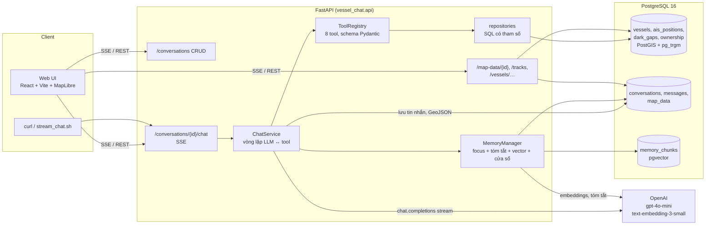
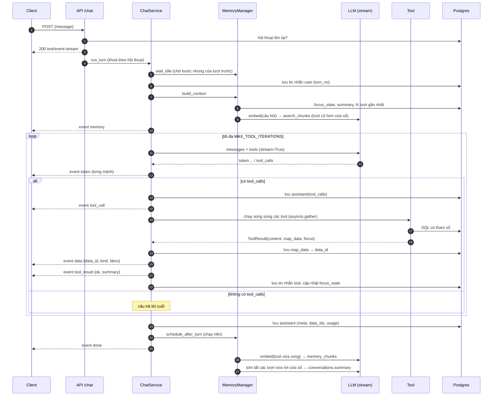
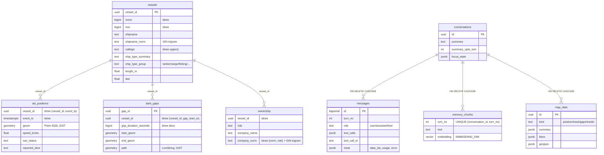

# Kiến trúc

## 1. Sơ đồ thành phần

**Nguyên tắc chính**

- **LLM không bao giờ thấy dữ liệu thô.** Tool trả cho LLM một bản tóm tắt đã giới hạn (`TOOL_RESULT_MAX_ROWS`). GeoJSON được lưu vào bảng `map_data`, stream chỉ gửi `data_id`, và client tự tải về.
- **Không có text-to-SQL.** Mọi truy vấn là SQL viết sẵn với tham số `$n` (asyncpg). Những lựa chọn như `order_by` được ánh xạ sang các đoạn SQL cố định.
- **Mọi thành phần phụ thuộc vào giao diện, không phụ thuộc cài đặt cụ thể.** `ChatService` chỉ biết `LLMClient`/`Embedder` (Protocol), nên test thay bằng bản giả và đổi nhà cung cấp chỉ cần viết một lớp mới.
- **Mọi ngưỡng đều cấu hình được** qua biến môi trường (`config.Settings`, danh sách đầy đủ trong `.env.example`).

## 2. Luồng xử lý một câu hỏi

**Xử lý lỗi**

- Tool lỗi (tham số sai, không tìm thấy, SQL quá `DB_STATEMENT_TIMEOUT_MS`, lỗi bất ngờ) → tool trả `{"error": …}` cho LLM tự giải thích, đồng thời phát `tool_result ok=false`. Stream vẫn tiếp tục.
- LLM lỗi (mạng, rate limit, timeout `LLM_TIMEOUT_SECONDS`, SDK tự thử lại 2 lần) → phát `error`, lưu phần đã sinh, rồi **vẫn phát `done`**. Kết nối không bị treo.
- Client ngắt kết nối → task bị huỷ. Phần trả lời đã có vẫn được lưu nhờ `asyncio.shield` (đánh dấu `interrupted`), và bộ nhớ vẫn được cập nhật.
- Lượt bị ngắt giữa lúc gọi tool có thể để lại `tool_calls` chưa có kết quả. Khi dựng ngữ cảnh, những lời gọi đó bị loại bỏ để OpenAI không từ chối request.
- Vòng lặp tool có giới hạn. Ở vòng cuối, tool bị tắt để buộc model trả lời bằng dữ liệu đã có.

**Nhiều hội thoại song song:** trạng thái của mỗi request nằm trong biến cục bộ, còn mọi truy vấn hội thoại và bộ nhớ đều lọc theo `conversation_id`. Có một `asyncio.Lock` riêng cho từng hội thoại, để hai lượt của *cùng* một hội thoại chạy tuần tự, trong khi các hội thoại khác nhau vẫn chạy song song (`tests/integration/test_api.py::test_parallel_conversations_do_not_mix`).

## 3. Thiết kế bộ nhớ

Prompt của mỗi lượt được dựng theo thứ tự:

| # | Phần | Nguồn | Mục đích |
|---|---|---|---|
| 1 | System prompt | `llm/prompts.py`, phạm vi dữ liệu điền từ DB khi khởi động | Quy tắc chống bịa, UTC, cách dùng tool |
| 2 | Trạng thái hội thoại | `conversations.focus_state` do **code** cập nhật từ tham số/kết quả tool (tàu, công ty, thời điểm, khoảng thời gian, bộ lọc nhiều hành trình) | Hiểu "nó", "tàu đó", "công ty đó", "ngày hôm sau" kể cả khi lượt gốc đã trôi khỏi cửa sổ |
| 3 | Tóm tắt | `conversations.summary` (tới lượt `summary_upto_turn`) | Giữ nguyên văn mã hồ sơ, tên, yêu cầu ghi nhớ; kết quả chính |
| 4 | Ký ức vector | top-`MEMORY_TOP_K` trong `memory_chunks` của **đúng hội thoại**, chỉ lấy lượt cũ hơn cửa sổ, cosine ≥ `MEMORY_MIN_SCORE` | Nhớ lại chi tiết mà bản tóm tắt có thể bỏ sót |
| 5 | Cửa sổ nguyên văn | `MEMORY_WINDOW_TURNS` lượt gần nhất, giới hạn `MEMORY_WINDOW_MAX_TOKENS`; kết quả tool của các lượt cũ hơn lượt mới nhất bị rút gọn còn `MEMORY_TOOL_RESULT_MAX_CHARS` | Trả lời câu nối tiếp chính xác ("trong số đó…") |
| 6 | Câu hỏi hiện tại | | |

**Sau mỗi lượt (chạy nền, tuần tự theo từng hội thoại)**

1. `embed_turn`: văn bản của lượt ("Người dùng / Tool(tham số) / Trợ lý", không kèm dữ liệu thô) được nhúng và upsert vào `memory_chunks`. Lượt sau chỉ **chờ bước này**, tối đa `MEMORY_COMPACTION_WAIT_SECONDS`.
2. `update_summary`: nếu có lượt vừa rời cửa sổ, LLM gộp lượt đó vào bản tóm tắt theo mẫu cố định. Bước này **không chặn** lượt sau. Trong lúc tóm tắt chưa xong, lượt đó vẫn truy xuất được qua vector, nên không mất thông tin. Nhờ tách hai bước này, thời gian đến token đầu tiên trung bình ở kịch bản 3 giảm từ 7,1 giây xuống 3,5 giây.

**Vì sao không dùng index ANN cho `memory_chunks`:** truy xuất luôn lọc theo một hội thoại (thường chỉ vài chục đến vài nghìn đoạn), nên quét chính xác trên tập đã lọc (`WITH … AS MATERIALIZED`) vừa rẻ vừa cho kết quả đúng. Nếu dùng HNSW kèm bộ lọc, kết quả có thể bị thiếu. Khi cần tìm ký ức xuyên hội thoại ở quy mô lớn, có thể thêm HNSW (`vector_cosine_ops`) và bật `hnsw.iterative_scan` của pgvector 0.8.

**Kiểm chứng**

- Kịch bản 3 chạy với `MEMORY_WINDOW_TURNS=2`. Transcript [results/s3_long_memory.md](../results/s3_long_memory.md) cho thấy ở lượt 13, cửa sổ chỉ gồm lượt 11–12, còn lượt 1 được truy xuất với điểm 0,585, và câu trả lời đúng HS-2026-117 / MSC MANYA.
- Test tự động: `test_long_conversation_recalls_first_turn` và `tests/unit/test_memory.py`.

## 4. Schema cơ sở dữ liệu

**Nạp dữ liệu (`scripts/load_data.py`)**

1. Đọc CSV bằng Python, chuẩn hoá giá trị rỗng thành NULL, đổi số kiểu float thành int (IMO, năm đóng), và tính các cột `*_norm` và `ship_type_group`. Hàm chuẩn hoá này dùng chung với tầng truy vấn.
2. Trong **một** transaction: `COPY` (binary) vào bảng tạm, `TRUNCATE` 4 bảng dữ liệu, rồi `INSERT … SELECT` để dựng geometry. Nếu lỗi giữa chừng, dữ liệu cũ vẫn còn nguyên. Chạy lại không nhân đôi; bảng hội thoại không bị động tới.
3. Chạy `ANALYZE`. Toàn bộ 177 nghìn dòng nạp trong khoảng 7–13 giây.

**Xử lý dữ liệu nhiễu**

| Vấn đề | Cách xử lý |
|---|---|
| Tên tàu rỗng hoặc gần trùng, người dùng gõ sai | `shipname_norm` + trigram (`similarity`, `word_similarity`). Khớp chính xác được ưu tiên; nếu mơ hồ thì trả danh sách ứng viên để hỏi lại. Tên rỗng hiển thị "(không tên)". |
| Tên công ty có biến thể | `company_norm` bỏ dấu câu và hậu tố pháp lý ở cuối tên (CO, LTD, PTE, CORP, SA, KK…); 8 nhóm biến thể được gộp. Các pháp nhân khác tên (EVERGREEN MARINE ASIA ≠ EVERGREEN MARINE CORP) **không** bị gộp và được liệt kê ở `similar_companies_not_included`. |
| Điểm GPS nhảy | Loại điểm có tốc độ suy ra tới **cả** điểm trước và điểm sau vượt `MAX_PLAUSIBLE_SPEED_KNOTS`; báo `removed_noise_points`. |
| Tàu rời vùng rồi quay lại | Khoảng trống lớn hơn `TRACK_GAP_SPLIT_HOURS` được tách thành MultiLineString (không vẽ nối qua). Quãng đường qua khe được báo riêng, kèm `coverage_warnings` sinh từ dữ liệu. |
| Nhãn loại tàu tiếng Anh | Có 34 nhãn AIS, được gộp thành 10 nhóm; mô tả tool ghi rõ "tàu chở dầu = tanker", "tàu hàng = cargo"… |
| Hỏi thời điểm không có dữ liệu | `get_position_at` báo `no_data_near_time` (lệch quá `POSITION_MAX_OFFSET_MINUTES`), nêu điểm trước/sau và cho biết thời điểm đó có nằm trong một dark gap hay không. |

## 5. Danh sách tool

| Tool | Tham số | Trả cho LLM | Bản đồ |
|---|---|---|---|
| `search_vessels` | `query`, `limit` | Ứng viên + điểm khớp | – |
| `get_vessel_details` | `vessel` | Mã nhận dạng, cờ, loại, kích thước, trọng tải (tấn) và dung tích (GT), công ty theo vai trò, tóm tắt AIS | – |
| `find_company_vessels` | `company_name`, `role?`, `exclude_vessel?` | Biến thể tên, danh sách tàu (đánh dấu tàu đang bàn), các công ty tương tự không được gộp | – |
| `get_position_at` | `vessel`, `timestamp` | Điểm trước/sau, độ lệch, vị trí chính xác / nội suy / điểm gần nhất, `explanation`, dark gap bao trùm (nếu có) | điểm |
| `get_last_position` | `vessel` | Điểm cuối cùng | điểm |
| `get_track` | `vessel`, `start`, `end` | Điểm đầu/cuối, số điểm, điểm nhiễu bị loại, quãng đường, tốc độ TB, khe, cảng đích khai báo, `coverage_warnings` | đường + điểm đầu/cuối |
| `get_dark_gaps` | `vessel?`, `start?`, `end?`, `order_by`, `limit` | Thời gian, độ dài, vị trí mất/có lại, khoảng cách, tốc độ trước và sau | điểm mất/lại + đường nét đứt |
| `get_multi_tracks` | `start`, `end`, `company_name?`, `role?`, `ship_type_group?` | **Chỉ tóm tắt:** số tàu, số điểm, bbox, tổng quãng đường, xếp hạng quãng đường | FeatureCollection nhiều tàu |

Tham số `vessel` nhận tên, MMSI, IMO, callsign hoặc `vessel_id`, và được phân giải bởi `resolve_vessel`. Kết quả phân giải là một trong ba trường hợp: một tàu duy nhất, `ambiguous` (kèm ứng viên) hoặc `not_found`. Các thông báo như `explanation` và `coverage_warnings` được **sinh từ dữ liệu** (không viết sẵn theo kịch bản), để model nhỏ truyền đạt đúng các cảnh báo quan trọng.

## 6. API

Chi tiết xem [api.md](api.md); schema đầy đủ ở [openapi.json](openapi.json), hoặc tại `/docs` khi server đang chạy.

| Method | Path | Mô tả |
|---|---|---|
| POST | `/conversations` | Tạo hội thoại |
| GET | `/conversations` | Danh sách hội thoại |
| GET | `/conversations/{id}` | Chi tiết (tóm tắt, focus_state) |
| GET | `/conversations/{id}/messages` | Toàn bộ tin nhắn (kể cả tool) |
| GET | `/conversations/{id}/map-data` | Các lớp bản đồ đã sinh |
| DELETE | `/conversations/{id}` | Xoá (cascade tin nhắn, ký ức, dữ liệu bản đồ) |
| POST | `/conversations/{id}/chat` | **SSE**: `memory`, `token`, `tool_call`, `data`, `tool_result`, `error`, `done` |
| GET | `/map-data/{data_id}` | GeoJSON của một lớp |
| GET | `/tracks` | Nhiều hành trình (FeatureCollection, phân trang theo tàu) |
| GET | `/vessels/search` | Tìm tàu |
| GET | `/vessels/{vessel}/dark-gaps` | GeoJSON các lần mất tín hiệu |
| GET | `/health` | Kiểm tra sống |

## 7. Frontend

- Bố cục ba cột: danh sách hội thoại, bản đồ, khung hỏi đáp. Trên màn hình hẹp, chuyển thành hai tab và một ngăn kéo cho danh sách hội thoại.
- Stream đọc bằng `fetch` + `ReadableStream`, vì `EventSource` không hỗ trợ POST. Bộ đọc SSE có test cho trường hợp sự kiện bị cắt qua nhiều mảnh.
- Khi nhận sự kiện `data`, client tải `/map-data/{id}`, **thêm** một lớp mới (không xoá lớp cũ) và tự zoom tới lớp đó. Ô chú giải cho phép bật/tắt, xoá từng lớp, hoặc xoá toàn bộ bản đồ. Khi mở lại hội thoại cũ, 6 lớp gần nhất được nạp lại.
- Nhiều hành trình được vẽ bằng một lớp `line` WebGL duy nhất, màu lấy theo `color_index`. Server giảm mẫu đều khi vượt `MULTI_TRACK_MAX_POINTS`: 35,7 nghìn điểm của 484 tàu vẫn vẽ mượt; 1000 tàu × 3 ngày (171 nghìn điểm) được giảm còn khoảng 60 nghìn điểm.

## 8. Hạn chế đã biết

- **Model nhỏ đôi khi bỏ sót cảnh báo.** gpt-4o-mini thỉnh thoảng không nhắc hết `coverage_warnings`. Ví dụ ở kịch bản 2, lượt 3, model có nói về khe mất tín hiệu nhưng không nói dữ liệu ngày 12/09 kết thúc lúc 11:48. Số liệu vẫn đúng. Có thể khắc phục bằng model mạnh hơn hoặc một bước hậu kiểm.
- **Hai nguồn khoảng mất tín hiệu hơi khác nhau.** Khe tính từ điểm AIS có trong dữ liệu có thể lệch vài phút so với `dark_gaps.csv`, vì bảng đó được tính từ nguồn dày hơn. Tool báo rõ từng nguồn.
- **Quãng đường tính theo đường nối các điểm AIS**, không phải đường đi thực tế. Quãng qua khe tính theo đường thẳng và được báo riêng. So với PostGIS geodesic trên điểm thô, chênh lệch dưới 0,5% (xem `results/facts.md`).
- **Chuẩn hoá tên công ty dựa trên quy tắc**, có thể gộp nhầm hai pháp nhân chỉ khác hậu tố (vd. `FIRST STEAMSHIP CO LTD` và `FIRST STEAMSHIP SA`). Tool luôn trả danh sách biến thể để minh bạch.
- **Không mô tả địa danh.** Vị trí chỉ được nêu bằng toạ độ, không có reverse geocoding (cảng/vùng biển), để tránh bịa địa danh.
- **Tóm tắt chạy nền là best-effort.** Nếu process dừng giữa chừng, lượt đó vẫn truy xuất được qua vector, và bản tóm tắt sẽ bắt kịp ở lượt kế tiếp.
- **Chưa có xác thực và phân quyền.** Mọi hội thoại đều thấy được bởi mọi client.

## 9. Độ trễ và chi phí (đo trên 27 lượt của 5 kịch bản trong đề)

| Chỉ số | Giá trị |
|---|---|
| Thời gian tới token đầu tiên (trung vị) | 3,6 giây (gồm 1–2 lần gọi LLM khi có tool) |
| Thời gian toàn lượt (trung vị / p90) | 4,8 giây / 6,7 giây |
| Truy vấn tool | 1–30 ms; `get_multi_tracks` 1000 tàu × 3 ngày ≈ 2 giây |
| Token vào / ra trung bình mỗi lượt | ~9,3 nghìn / ~210 (system prompt ~1,3 nghìn + schema tool ~2,5 nghìn + ngữ cảnh + kết quả tool) |
| Chi phí mỗi lượt (gpt-4o-mini: 0,15 / 0,60 USD cho 1 triệu token) | ≈ 0,0015 USD; embedding và tóm tắt thêm < 0,0002 USD |
| Toàn bộ 9 bộ kịch bản (43 lượt) | ≈ 0,06 USD |

Có thể giảm tiếp: OpenAI tự cache prefix ≥ 1024 token (system prompt + schema tool giữ cố định ở đầu), và kết quả tool cũ trong cửa sổ đã được rút gọn.

## 10. Hướng mở rộng khi dữ liệu lên vài chục triệu điểm/ngày

1. **Lưu trữ.** Phân vùng `ais_positions` theo ngày (TimescaleDB hypertable hoặc declarative partitioning), nén các chunk cũ, và giữ chỉ mục BRIN trên `event_ts` thay cho B-tree toàn bảng. Có thể thêm continuous aggregate theo giờ/tàu (quãng đường, bbox, số điểm), để `get_track` nhiều ngày và các câu hỏi xếp hạng không phải quét điểm thô.
2. **Nạp dữ liệu.** Thay batch CSV bằng streaming (Kafka hoặc Redpanda) → consumer ghi COPY theo lô. Dark gap tính tăng dần theo từng tàu bằng stream processing (Flink hoặc Materialize) thay vì tính lại toàn bộ.
3. **Phân tích lớn.** Xếp hạng toàn đội tàu và nhiều hành trình trên nhiều ngày có thể chuyển sang kho cột (ClickHouse, DuckDB/Parquet trên S3). Postgres giữ vai trò tra cứu theo tàu.
4. **Bản đồ.** Không gửi GeoJSON lớn nữa, mà sinh vector tile động (PostGIS `ST_AsMVT`, Martin hoặc pg_tileserv) theo bộ lọc; hoặc đơn giản hoá hình học theo zoom (`ST_SimplifyPreserveTopology`), kết hợp deck.gl `TripsLayer` cho hàng triệu điểm. `map_data` chuyển sang object storage có TTL.
5. **Dịch vụ.** Chạy nhiều bản API sau load balancer (SSE không cần sticky session, vì trạng thái nằm trong DB). Khoá theo hội thoại chuyển sang Redis hoặc advisory lock của Postgres; tác vụ nhúng/tóm tắt chuyển sang hàng đợi (Arq, Celery). Tách read replica cho truy vấn tool.
6. **Bộ nhớ.** Khi có nhiều người dùng: dùng HNSW với `iterative_scan` hoặc Qdrant/Milvus, thêm namespace theo người dùng, và rút trích "sự kiện cần nhớ" có cấu trúc (mã hồ sơ, tàu theo dõi) vào bảng riêng.
7. **Chất lượng.** Bộ đánh giá tự động: sinh câu hỏi từ template × dữ liệu, so đáp án với `verify_facts`, dùng LLM làm giám khảo để đo độ đúng và việc truyền đạt cảnh báo. Chạy trong CI khi đổi prompt hoặc model.
